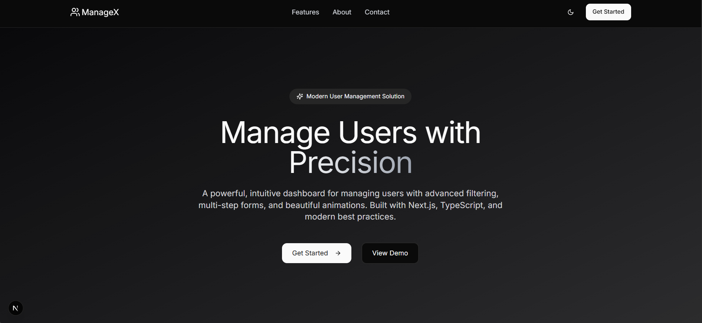

# 🚀 ManageX

A modern, responsive user management system featuring a **multi-step user registration form** , built with **Next.js**, **React Hook Form**, **TypeScript**, **Tailwind CSS**, and **Framer Motion**. 

🔗 **Live Demo**: [live url](https://manage-x.vercel.app/)

It offers real-time form validation with **Zod**, centralized state management, and smooth animations for an enhanced user experience.



## Table of Contents

- [Features](#features)
- [Tech Stack](#tech-stack)
- [Form Steps](#form-steps)
- [Project Structure](#project-structure)
- [Installation](#installation)

## ✨ Features

- **Multi-Step Registration**: Collects user data across three logical steps with real-time validation
- **Responsive Design**: Theme-aware UI with smooth animations and toast notifications
- **Form Validation**: Real-time validation using Zod with React Hook Form
- **State Management**: Centralized form state using React Context
- **Dashboard Interface**: Clean dashboard for viewing and managing users
- **Smooth Animations**: Enhanced UX with Framer Motion transitions

## 🧰 Tech Stack

- **Frontend**: Next.js, TypeScript
- **Styling**: Tailwind CSS, Shadcn UI
- **Form Management**: React Hook Form, Zod
- **State Management**: React Context
- **Animations**: Framer Motion
- **Routing**: Next.js App Router

## 📝 Form Steps

### 1. Basic Information
- **Fields**: Name (min 2 chars), Email (must be valid)
- **Validation**: Zod schema with real-time feedback

### 2. Address Details
- **Fields**: Street (min 5 chars), City (min 2 chars), Zip Code (min 5 chars)
- **Validation**: Comprehensive address validation

### 3. Review & Confirm
- **Display**: Complete summary of all entered data
- **Actions**: Edit previous steps or submit final form

## 📁 Project Structure

```
user-management-system/
├── app/
│   ├── dashboard/
│   │   ├── page.tsx             # Dashboard view
│   │   ├── layout.tsx           # Dashboard layout
│   │   └── add/
│   │       └── page.tsx         # Add user form
│   ├── layout.tsx               # Root layout
│   ├── globals.css              # Global styles
│   └── page.tsx                 # Landing page
├── components/
│   ├── dashboard/
│   │   └── header.tsx           # Dashboard header
│   ├── forms/
│   │   ├── add-user-form.tsx    # Multi-step form wrapper
│   │   ├── form-context.tsx     # Centralized form state
│   │   └── steps/
│   │       ├── basic-info-step.tsx  # Step 1: Basic Info
│   │       ├── address-step.tsx     # Step 2: Address
│   │       └── review-step.tsx      # Step 3: Review & Submit
│   ├── landing/
│   │   ├── header.tsx           # Landing page header
│   │   ├── footer.tsx           # Footer section
│   │   └── landing-page.tsx     # Main landing content
│   └── ui/                      # Shadcn UI components
├── public/                      # Static assets
├── tailwind.config.ts           # Tailwind configuration
└── README.md                    # Project documentation
   # more configs                  

```

## ⚙️ Installation

1. **Clone Repository:**
   ```bash
   git clone https://github.com/your-username/user-management-system.git
   cd user-management-system
   ```

2. **Install Dependencies:**
   ```bash
   npm install
   ```

3. **Run Development Server:**
   ```bash
   npm run dev
   ```

4. **Open in Browser:**
   Visit `http://localhost:3000`

---